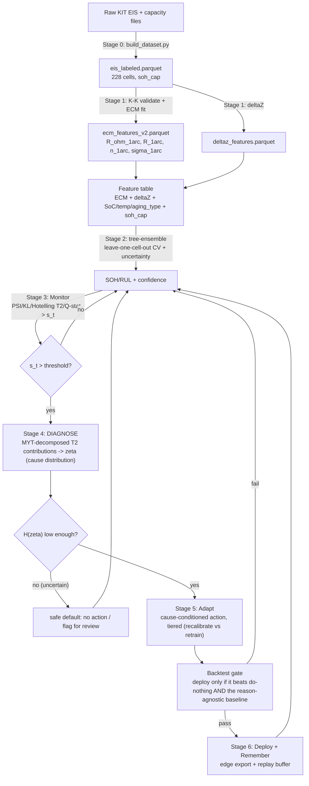

# EIS-Driven Battery SOH/RUL Estimation with Physics-Grounded Self-Healing

A research framework for estimating battery **State of Health (SOH)** and **Remaining Useful Life (RUL)** from **Electrochemical Impedance Spectroscopy (EIS)** measurements. Raw impedance spectra are first reduced to a small set of physically interpretable **Equivalent Circuit Model (ECM)** parameters. Those parameters — together with operating conditions — feed a machine-learning model that learns how battery health evolves and predicts SOH/RUL with a confidence estimate. A **monitor → diagnose → adapt → test → deploy/remember** self-healing loop keeps the deployed model accurate as cells age — and, unlike prior drift-adaptation work, **attributes drift to a specific physical mechanism** (electrolyte/contact loss, interfacial kinetics, surface-film growth, or diffusion resistance) rather than only detecting *that* something changed.

> **Status:** **Stage 0 (data prep) is complete.** **Stage 1 (ECM fitting) is integrated and validated** — Kramers–Kronig checked, 1-arc primary resistance feature chosen for stability, 99%+ usable feature coverage. **Stage 2 onward (health model → monitor → diagnose → adapt/test → deploy) is designed, not yet built** — this document describes that design. See [Open Decisions](#13-open-decisions) for what's still unsettled, and [`data_exploration.md`](data_exploration.md) / [`src/ecm/ecm_v2.md`](src/ecm/ecm_v2.md) for the full evidence behind Stages 0–1.
>
> **The core novelty** is Stage 4 ([Diagnose](#9-stage-4--diagnose-physics-grounded-root-cause-attribution)): existing self-healing-ML theory (Rauba et al.) has no battery instantiation, and the one battery-specific roadmap (Das et al.) is explicitly conceptual, not built. This project targets a working, real-data instantiation of physics-grounded drift diagnosis — the genuine gap between the two.
>
> 📄 For the full, step-by-step account of the data work — every decision and the evidence behind it — see [`data_exploration.md`](data_exploration.md).

---

## Table of Contents

1. [Motivation](#1-motivation)
2. [Why EIS + ECM + ML](#2-why-eis--ecm--ml)
3. [Dataset](#3-dataset)
4. [Pipeline Overview](#4-pipeline-overview)
5. [Stage 0 — Data Preparation](#5-stage-0--data-preparation)
6. [Stage 1 — Feature Extraction (EIS → ECM)](#6-stage-1--feature-extraction-eis--ecm)
7. [Stage 2 — Health Model (ML)](#7-stage-2--health-model-ml)
8. [Stage 3 — Monitor (Drift Detection)](#8-stage-3--monitor-drift-detection)
9. [Stage 4 — Diagnose (Physics-Grounded Root-Cause Attribution)](#9-stage-4--diagnose-physics-grounded-root-cause-attribution)
10. [Stage 5 — Adapt & Test (Cause-Conditioned Self-Healing)](#10-stage-5--adapt--test-cause-conditioned-self-healing)
11. [Stage 6 — Deploy & Remember](#11-stage-6--deploy--remember)
12. [Evaluation & Validation](#12-evaluation--validation)
13. [Open Decisions](#13-open-decisions)
14. [Roadmap](#14-roadmap)
15. [References](#15-references)

---

## 1. Motivation

Battery health is not directly measurable in the field. Capacity tests are slow and disruptive, and simple voltage/current proxies miss the underlying electrochemical changes that drive ageing. EIS probes a cell across a wide frequency range and separates distinct physical processes — ohmic conduction, charge transfer, double-layer behaviour, and diffusion — by the timescale on which they respond. These processes carry a rich, early signature of degradation.

The goal of this project is a health-estimation system that is:

- **Physically grounded** — features map to real electrochemical quantities, not opaque statistics.
- **Uncertainty-aware** — every SOH/RUL estimate carries a confidence value, because a confidently wrong estimate in a safety-critical system is dangerous.
- **Lifelong** — the model does not silently degrade as cells age out of the training distribution; it detects drift and adapts.

## 2. Why EIS + ECM + ML

A purely data-driven model trained on raw spectra can be accurate but brittle and hard to interpret. A purely physics-based ECM is interpretable but cannot, by itself, capture the full nonlinear way that parameters evolve with SOH, State of Charge (SOC), and temperature. This framework is a **gray-box** combination:

- The **ECM** compresses each spectrum into a handful of meaningful parameters (resistances, capacitive behaviour, diffusion). This is dimensionality reduction with physical meaning.
- The **ML model** learns the empirical *evolution law* — how those parameters and their deviations relate to SOH/RUL across operating conditions.

This split keeps the inputs interpretable and the predictor flexible, which generally generalises better and is easier to trust than either approach alone.

## 3. Dataset

The data comes from the **KIT comprehensive battery aging dataset** (RADAR4KIT, DOI `10.35097/1969`; published in *Scientific Data*, 2024 — *"Comprehensive battery aging dataset: capacity and impedance fade measurements of a lithium-ion NMC/C-SiO cell"*).

**228 commercial LG INR18650HG2 cells** — NMC cathode, graphite + SiO anode, 3.0 Ah nominal — were aged for ~600 days under **76 parameter sets** (16 calendar, 48 cyclic, 12 driving-profile/WLTP aging), 3 replicate cells per set, across four temperatures (0 / 10 / 25 / 40 °C), three SoC windows, and varying charge/discharge rates. Roughly every three weeks each cell was paused for a standardized **check-up (CU)**: brought to room temperature, given a full capacity test, then stepped through SoC = 10/30/50/70/90 % with an EIS sweep + current-pulse at each stop (the **RT pass**); then returned to its operating temperature and the EIS + pulse sequence repeated at the same five SoC points (the **OT pass**). This is why every cell has a tight ~25 °C measurement cluster (RT) plus a cluster at its own native temperature (OT).

### The three "lifestyles" (aging types)
Every cell falls into one of three regimes, and this is the single most important thing to know about any given cell, because it explains why it's degrading:
**1) Calendar aging (16 of the 76 groups)** — the cell just sits there, held at a constant voltage (constant SoC), at one of four temperatures. No cycling at all between check-ups. This simulates a battery sitting in storage or barely used. The stress factors here are purely temperature and how charged the cell is kept.
**2) Cyclic aging (48 of the 76 groups, the largest chunk)** — the cell is continuously charged and discharged back and forth between two SoC limits (e.g., 0–100%, or 10–90%), at a chosen charge rate and discharge rate, at one of four temperatures. This simulates a battery in constant heavy use.
**3) Profile aging (12 of the 76 groups)** — instead of a simple back-and-forth, the cell is discharged following a real driving-cycle power profile (WLTP — the standard European driving test cycle used for EV range testing), then recharged. This simulates an EV battery in actual use.
Every group also gets one of four temperatures: 0°C, 10°C, 25°C, 40°C — these are physically four separate temperature-controlled oil baths ("pools") the cells sit in.

### What happens during a check-up (CU)
Roughly every three weeks, a cell's regular charge/discharge routine is paused, and it goes through a standardized health check, always in the same order: first its temperature is brought to room temperature (RT, ~25°C) regardless of what temperature it normally lives at; then its capacity is measured with one full 0→100→0% charge-discharge; then, staying at RT, it's stepped up through SoC = 10%, 30%, 50%, 70%, 90%, and at each stop an EIS measurement (impedance spectrum) plus a current-pulse test is taken. Once that's done, the cell is brought back to its real operating temperature (OT — 0, 10, 25, or 40°C, whichever it normally lives at), and the same EIS + pulse test sequence is repeated at the same five SoC points, but now sweeping back down 90→70→50→30→10%. Only after both passes are done does the cell resume its normal aging routine. This is why every cell, no matter its real living temperature, has a cluster of measurements at a tight ~25°C (the RT pass) and a separate cluster at its own native temperature (the OT pass) — exactly the pattern that showed up in your data as the cycles/is_rt flag.


### Stage 0 output — the working dataset

The original teammate-cleaned `eis_cleaned.csv` was **discarded**: it had been truncated at the Excel
1,048,575-row cap (only 216 of 228 cells) and stripped of most useful columns. We rebuilt everything
from the raw KIT files into **`data/interim/eis_labeled.parquet`** — the single working dataset for all
downstream stages. **One row = one frequency point of one clean spectrum.**

- **228 cells** (Calendar 48 / Cyclic 144 / Profile 36) · **39,368 spectra** · **1,102,304 rows** · 28 frequency points per spectrum.
- **Reconstructed time axis** (`cu_index`, 0–28) — the check-up order, absent from the raw files, rebuilt from timestamps.
- **Recipe metadata joined** (aging type, temperature setpoint, SoC/C-rate categories) per cell.
- **Capacity-based SOH (`soh_cap`) attached to 100 % of rows** as the model target.

Key columns (full dictionary in [`data_exploration.md`](data_exploration.md)):

| Column | Unit | Meaning |
|---|---|---|
| `cell_id` (+ `pack`,`replicate`,`board`,`channel`,`param_id`) | — | Cell fingerprint `P###_#_S##_C##`. One cell = **the grouping key for all splits**. |
| `cu_index` | — | Reconstructed check-up index (the ageing/time axis). |
| `freq_Hz` | Hz | Test frequency (28 per spectrum, 0.05 Hz – 10 kHz). |
| `Z_real_mOhm` / `Z_imag_mOhm` | mΩ | Compensated real Z′ / imaginary Z″ (sign convention to be locked at ECM time). |
| `soc_nom` | % | One of the five checkpoints (10/30/50/70/90). |
| `is_rt` | — | 1 = RT pass (~25 °C), 0 = OT pass (native temperature). |
| `temp_degC` | °C | Actual measured temperature during the spectrum. |
| `aging_type`, `temp_setpoint_degC` | — | Recipe metadata: why the cell ages. |
| `soh_imp`, `z_ref_init_mOhm`, `z_ref_now_mOhm` | % / mΩ | Impedance-based SOH and its reference impedances (secondary/sanity). |
| **`soh_cap`** | % | **Capacity-based SOH — the prediction target.** |

**Dataset caveats — all resolved in Stage 0** (details in [`data_exploration.md`](data_exploration.md)):

- ~~Excel truncation~~ → rebuilt from raw to Parquet (uncapped); all 228 cells recovered.
- ~~No time/age axis~~ → `cu_index` reconstructed by sessionizing timestamps (48-hour gap threshold).
- ~~Missing recipe metadata~~ → joined from the KIT parameter spreadsheet by `P`-code.
- ~~Health-target undecided~~ → capacity-SOH chosen and attached (see [§7](#7-stage-2--health-model-ml)).

## 4. Pipeline Overview



A rendered version of an earlier draft of this pipeline is in [`pipeline_diagram.png`](pipeline_diagram.png) (superseded by the diagram above, which reflects the Monitor/Diagnose/Adapt+Test/Deploy split described in [§8](#8-stage-3--monitor-drift-detection)–[§11](#11-stage-6--deploy--remember)).

## 5. Stage 0 — Data Preparation

> ✅ **COMPLETE.** Output: `data/interim/eis_labeled.parquet`. Reusable code in [`src/prep/`](src/prep/); full narrative in [`data_exploration.md`](data_exploration.md).

1. ✅ **Regenerate an uncapped dataset.** Rebuilt from the raw KIT files to Parquet — all **228 cells / 76 recipes** recovered (the old CSV had only 216). Empty `P000` placeholder files (12) skipped.
2. ✅ **Reconstruct the time/age axis.** `cu_index` rebuilt by sessionizing spectrum timestamps with a **48-hour gap threshold** (verified across recipes/temperatures).
3. ✅ **Join recipe metadata.** Aging type, temperature setpoint (A/B/C/D → 0/10/25/40 °C), SoC and C-rate categories joined per `P`-code — with an explicit guard against a one-to-many join duplication bug.
4. ✅ **Choose the health target.** **Capacity-based SOH (`soh_cap`)** selected (non-circular), extracted from the check-up discharge capacity test (`cell_eocv2`, `cyc_condition==2 & cyc_charged==0`) and aligned to each spectrum by nearest time (100 % matched).
5. ✅ **Clean labels and define grouping.** Grouping key defined (`cell_id`). `soh_cap` is physically bounded at 0%; negative readings (0.09% of spectra, genuine near-dead cells) are **clipped to 0** via `src/prep/labels.py`, with the original preserved in `soh_cap_raw` — nothing silently discarded. The suspected "CU-27 artifact" was re-checked at full-population scale (228 cells) on both `soh_cap` and `soh_imp`: **no synchronized dip found** — the original observation was from an early 6-cell plot and does not generalize; no special handling needed.

## 6. Stage 1 — Feature Extraction (EIS → ECM)

> ✅ **Integrated and validated.** Code: [`src/ecm/fit_ecm_v2_with_kk.py`](src/ecm/fit_ecm_v2_with_kk.py); full narrative and decisions log in [`src/ecm/ecm_v2.md`](src/ecm/ecm_v2.md). ΔZ code: [`src/features/deltaz.py`](src/features/deltaz.py) (narrative: [`src/features/deltaz.md`](src/features/deltaz.md)).

Each spectrum (one cell, one SoC, one pass, one check-up) is processed as follows.

**6.1 Validate first (Kramers–Kronig).** ✅ Done via `impedance.py`'s `linKK` (the Schönleber et al. 2014 linear measurement-model approach — fits a generic series of Voigt/RC elements, which satisfy KK by construction, and uses the residual as the consistency check; the classical KK integral relations are numerically ill-posed to evaluate directly over a finite discretely-sampled sweep, which is why this measurement-model approach is standard practice rather than a shortcut). **96.3%** of spectra pass (`kk_max_residual < 5%`); failures are **flagged, not dropped** (`kk_valid` column) — downstream stages decide whether to exclude them.

**6.2 Fit an Equivalent Circuit Model.** ✅ Done. A Randles-type circuit (`L + R_ohm + (R∥CPE) + Warburg`, current Warburg type: semi-infinite) is fit to each KK-checked spectrum. Two topologies are fit per spectrum:

```
L + R_ohm + (R_sf ∥ CPE_sf) + (R_ct ∥ CPE_dl) + Warburg      # 2-arc (diagnostic only — see below)
L + R_ohm + (R_1arc ∥ CPE_1arc) + Warburg                     # 1-arc (PRIMARY — the stable feature)
```

**Why 1-arc is primary, not the textbook 2-arc split:** the two arcs' characteristic frequencies sit only ~3–10× apart on this cell chemistry — far below the ~100–1000× separation needed for two visibly distinct Nyquist semicircles (confirmed empirically on the real spectra). The 2-arc fit is consequently unstable: reliable only ~36% of the time (`reliable_split`, gated on AIC preference + CPE/R_ohm plausibility), and even where "reliable," its total resistance doesn't consistently match the simpler 1-arc estimate. The 1-arc fit is a **separate, simpler, better-conditioned optimization** — not a formula derived from the 2-arc split — and is the primary resistance feature. The 2-arc split (`R_sf`, `R_ct`) is retained as a **diagnostic-only** signal (see [Open Decisions](#13-open-decisions), DRT).

**6.3 Extracted features (the reliable, primary set).** Computed per spectrum, **99.05% usable coverage** (`fit_succeeded=True` and not `fit_1arc_implausible` — the guard added after finding a small fraction of degenerate near-zero-R_ohm / absurdly-large-R_1arc / implausible-n fits):

| Feature | Symbol | Physical meaning |
|---|---|---|
| Ohmic resistance | `R_ohm_1arc` | High-frequency real-axis intercept — electrolyte, contacts, current collectors. Grows with ageing. |
| Interfacial resistance (combined) | `R_1arc` | Combined charge-transfer + surface-film resistance (unresolved at this arc separation — see DRT in Open Decisions). Grows as the interface degrades. |
| CPE exponent | `n_1arc` (magnitude `Q_1arc`) | Depression of the arc — surface inhomogeneity / roughness of the double layer. Healthy range observed: median 0.61, IQR 0.53–0.69. |
| Warburg coefficient | `sigma_1arc` | Low-frequency diffusion behaviour — solid-state/electrolyte transport resistance. |
| Health deviation | `ΔZ_imag(f) = Z_imag,baseline(f) − Z_imag,now(f)` | Per-frequency deviation of the present spectrum from the cell's own first-check-up baseline. Validated: **r = −0.73** against `soh_cap` (imaginary-only; real part not yet added — see Open Decisions). |

Operating conditions (`soc_nom`, `temp_degC`) and recipe metadata (`aging_type`, `temp_setpoint_degC`) are carried alongside, because impedance depends strongly on both and aging mechanism differs by regime.

**On ΔZ:** the healthy reference is each cell's own **first valid check-up**, per `(cell_id, soc_nom, is_rt)` — matching the dataset's own `z_ref_init` convention. Note the first check-up is a *baseline*, not a pristine reference (cells start at ~98% capacity, not 100% — see [`data_exploration.md`](data_exploration.md) §6.1); ΔZ = 0 at the start is a normalization choice, not a claim the cell was flawless.

## 7. Stage 2 — Health Model (ML)

> 🟡 **Designed, not yet built.** This is the next implementation cycle.

The model maps `[ECM features + SoC + temp + aging metadata] → soh_cap` (and RUL vs. an end-of-life threshold) **with a confidence estimate**.

> **Health target — DECIDED (Stage 0): capacity-based SOH (`soh_cap`).** `soh_imp` is *derived from impedance*, and so are the ECM features, so predicting it from them is partly circular — deceptively accurate but hollow. We train against the **measured capacity fade** from each check-up's full charge/discharge (`cell_eocv2`), independent of impedance and the basis for RUL. `soh_cap` is clipped at 0% (negative readings are measurement noise around a dead cell — 0.09% of spectra, see [`data_exploration.md`](data_exploration.md)); the raw value is preserved in `soh_cap_raw`. `soh_imp` is retained only as a secondary sanity check.

> **Model family — DECIDED: an interpretable tree ensemble (LightGBM/XGBoost) is the model, not a placeholder baseline.** A more elaborate physics-residual architecture (`soh_cap_pred = f_physics(ΔZ) + g_NN(ECM params, SoC, temp)`, keeping ΔZ as a protected primary driver via an orthogonalized correction network) was explored by a contributor and remains available as documented, non-blocking exploratory work. The tree ensemble is preferred as the core model because: (1) health-model sophistication is *not* this project's evidenced novelty — many prior works already do SOH regression — the novelty is [Diagnose](#9-stage-4--diagnose-physics-grounded-root-cause-attribution) downstream; (2) SHAP importances over an interpretable model map directly onto the physical mechanism buckets Diagnose needs; (3) it's edge-deployable, matching the [Deploy & Remember](#11-stage-6--deploy--remember) requirement; (4) it validates whether the ECM features predict `soh_cap` at all before committing to a bespoke architecture.

Build order:

1. **No-leakage split first** (leave-one-cell-out; additionally hold out by **aging regime** and **temperature** to test robustness across conditions).
2. **Fit the tree ensemble** on the feature table: `R_ohm_1arc, R_1arc, n_1arc, sigma_1arc` + ΔZ summary + `soc_nom`/`temp_degC` + `aging_type`, filtered to `fit_succeeded & not fit_1arc_implausible`.
3. **Uncertainty.** Quantile regression or an ensemble spread for prediction intervals. Confidence is a first-class requirement.
4. **Attribution.** SHAP to confirm the model leans on physically meaningful features (`R_1arc`, `ΔZ`, `R_ohm_1arc`), not artifacts — this doubles as validation input for Diagnose's mechanism weighting.
5. **Report** MAE/RMSE ± std across folds, and a per-`aging_type` breakdown (a model that only works on one aging regime is a finding, not a footnote).

Outputs must respect physics: SOH near-monotonic non-increasing over life; resistances grow/hold; uncertainty widens out-of-distribution.

## 8. Stage 3 — Monitor (Drift Detection)

> 🟡 **Designed, not yet built.**

A model trained today will eventually face cells whose impedance signature has drifted beyond what it has seen. Monitor's job is narrow and deliberately dumb: **detect that something changed, output a single trigger scalar, and stop** — it does not explain *why* (that's [Diagnose](#9-stage-4--diagnose-physics-grounded-root-cause-attribution)). This separation of concerns follows Rauba et al.'s SHML formalism.

**8.1 Source the "aged" EIS.** This dataset spans ~600 days of repeated check-ups, so *"a cell aged a few months later"* spectra are **real, not synthetic** — later-CU spectra of the same cells (or held-out late-life recipes) serve directly as the drift test set. Synthetic generation is *optional*, for stress-testing beyond the observed range (see [Open Decisions](#13-open-decisions)).

**8.2 Re-extract parameters.** New spectra pass through the same Stage 1 pipeline to produce a new ECM feature set (`R_ohm_1arc`, `R_1arc`, `n_1arc`, `sigma_1arc`, ΔZ).

**8.3 Compute the drift scalar `s_t ∈ [0,1]`** — combining several distribution-shift measures over the ECM-parameter population, rather than relying on just one:

- **Population Stability Index (PSI)** per feature — bins a feature's distribution now vs. the healthy baseline. `< 0.1` no meaningful shift, `0.1–0.25` moderate, `> 0.25` significant.
- **KL divergence** / its symmetric form **Jensen–Shannon distance** — relative entropy of the new parameter distribution against baseline (PSI is essentially a symmetrised, binned KL).
- **Mahalanobis distance / Hotelling's T²** — `T² = n·(x̄ − μ)ᵀ Σ⁻¹ (x̄ − μ)`, the covariance-aware multivariate distance of the new ECM-parameter vector from the healthy baseline cloud. **This is computed here and reused directly in Diagnose** (§9) — Monitor and Diagnose share the same underlying statistic, decomposed differently.
- **Q-statistic / SPE** (optional, complementary) — project onto a PCA subspace of the healthy baseline, measure the reconstruction residual `Q = ‖x − x̂_PCA‖²`.

**8.4 Compare `s_t` to a threshold and act:**
- **`s_t` below threshold** → distribution stable; keep the current model, no further action.
- **`s_t` at or above threshold** → hand off to [Diagnose](#9-stage-4--diagnose-physics-grounded-root-cause-attribution).

**Validation:** confirm `s_t` rises on the dataset's own real later-life check-ups (no synthesis needed) before trusting the threshold.

## 9. Stage 4 — Diagnose (Physics-Grounded Root-Cause Attribution)

> 🟡 **Designed, not yet built. This is the project's core novelty** — see the status banner for why this is a genuine, unclaimed gap (Rauba et al.'s SHML formalism has no battery data; Das et al.'s battery-specific instantiation is an explicit roadmap, not a built system; the one real-hardware "self-healing" battery system in the literature is a frozen rule-based controller with no diagnosis step).

Monitor only says "drift detected." Diagnose answers **which physical mechanism is responsible**, as a probability distribution over candidate causes — not a single guess — following Das et al.'s formalism (`ζ`, a distribution over causes `Z`, with `Certainty(ζ) = H(ζ) = −Σᵢ ζᵢ·log(ζᵢ)`; their Proposition 1: the optimal diagnosis has zero entropy).

**9.1 Mechanism buckets (v1: the 4 reliable ECM features from Stage 1):**

| Feature | Mechanism | Coverage |
|---|---|---|
| `R_ohm_1arc` | Electrolyte / contact / current-collector resistance loss | 99%+ |
| `R_1arc` | Combined interfacial resistance (charge-transfer kinetics + surface-film/SEI, **unresolved** at this arc separation) | 99%+ |
| `n_1arc` | Surface roughness / double-layer inhomogeneity change | 99%+ |
| `sigma_1arc` | Diffusion / solid-state transport resistance change | 99%+ |
| ΔZ (optional 5th) | Aggregate aging-drift signal | validated, r=−0.73 vs `soh_cap` |

**Known resolution ceiling:** `R_1arc` collapses charge-transfer and surface-film contributions into one bucket, because the 2-arc split that would separate them is only reliable ~36% of the time (§6.2). **DRT (Distribution of Relaxation Times)** is the concrete future fix — deconvolving `Z(ω) − R_ohm − Z_W(ω) = ∫ γ(ln τ)/(1+jωτ) d(ln τ)` via Tikhonov-regularized inversion would let the number of arcs (and their timescale separation) be determined by the data rather than assumed, and could split this bucket properly. **Deferred to v2** (see Open Decisions) — v1 ships on the 4-bucket resolution and states this ceiling explicitly rather than overclaiming separation.

**9.2 Attribution method — covariance-aware, not marginal.** The 4 mechanism features are correlated by construction (the same reason the 2-arc split is unstable): a naive per-feature z-score cannot distinguish "`R_ohm_1arc` genuinely drifted" from "`R_ohm_1arc` just moves with `n_1arc`, which is the actual driver." Instead, **decompose the Hotelling T² already computed in Monitor** using **MYT (Mason–Young–Tracy) contribution decomposition** (or the simpler unconditional contribution `d_i = T² − T²_₍₋ᵢ₎`, the drop in T² from removing variable *i*) — this yields a per-mechanism contribution that correctly accounts for the covariance structure. Normalize the (non-negative) contributions into `ζ`.

**9.3 Required validation, in order:**
1. **Controlled sanity check (required, before real-data validation).** On held-out spectra, synthetically perturb *one* ECM feature by a known amount (e.g. inflate `sigma_1arc` by a fixed %, holding the others fixed), recompute `ζ`, and confirm the dominant mass lands on the correct bucket. Reports a clean, citable **attribution accuracy on ground-truth-known perturbations** — cheap, no new data needed.
2. **Real-data validation (stated conservatively).** Check whether `ζ` differs between **Calendar** vs. **Cyclic** recipes (`aging_type`, already in the metadata). Because of the resolution ceiling (9.1), the claim is: *"attribution mass shifts toward the diffusion/ohmic buckets under calendar aging and toward the combined interfacial bucket under cyclic aging"* — **not** a claim of clean SEI-vs-charge-transfer separation. Tested with a permutation test (or chi-square/Fisher's exact on the categorical dominant-cause label) comparing `ζ` (or dominant cause) across `aging_type` groups.

**9.4 Entropy-gated fallback (required, essentially free).** If `H(ζ)` exceeds a calibrated threshold (the diagnosis is uncertain/near-uniform), take a **safe default action** — no action, or flag for human review — rather than act on a low-confidence cause. Mirrors the safety emphasis in the source SHML papers; costs nothing extra since `H(ζ)` is already computed.

**9.5** *(Phase 2, optional)* Cross-validate with an **ICA/DVA**-derived signal: incremental capacity `dQ/dV` and differential voltage `dV/dQ` from the full charge/discharge curves already present in `cell_eocv2` — peak height/area loss attributes to LAM/LLI, position shift to electrode slippage/resistance growth. This gives a second, independent mechanism channel to cross-check the ECM-based diagnosis (matching Das et al.'s multi-signal causal-graph approach), at the cost of additional scope — not required for v1.

## 10. Stage 5 — Adapt & Test (Cause-Conditioned Self-Healing)

> 🟡 **Designed, not yet built.**

Adaptation is a **policy conditioned on the diagnosis**, `π(a | ζ)` — not a fixed response to "drift detected." This is what makes remediation proportional to the actual cause rather than just its magnitude.

**10.1 Concrete two-tier action policy:**
- **Tier 1 (cheap)** — ohmic/electrolyte-dominant cause, or low-magnitude drift → **isotonic/scalar recalibration** of the ensemble's output (a bias/scale correction fit on the recent backtest window; no retrain).
- **Tier 2 (expensive)** — interfacial/kinetics or diffusion-dominant cause, or high-magnitude drift → **full retrain with sample-reweighting** toward the new/recent-regime data.
- *(Stretch, optional)* Tier 1.5 — a targeted retrain restricted to the dominant mechanism's related features / recent same-regime data.

**10.2 Backtest gate — the safety mechanism, with an explicit acceptance criterion.** Every candidate fix is evaluated on a recent held-out window and deployed only if it achieves a **statistically meaningful reduction in SOH-prediction MAE** vs. the frozen prior model (e.g. a bootstrap confidence interval on the improvement excludes zero). This is what makes the loop robust to false alarms from Monitor — a noisy trigger doesn't matter if the bad fix gets filtered before touching production.

**10.3 Required control — the paper's central comparative claim.** Implement the **reason-agnostic policy** as well: the original magnitude-threshold-only gating (drift score ≥ threshold → fine-tune/retrain, with no diagnosis). Run **both** policies on the **same** backtest windows and report both. Without this side-by-side, there is a diagnosis system but no evidence that diagnosis-conditioned adaptation is actually *better* than magnitude-gated adaptation — which is the entire argument for building Diagnose at all.

## 11. Stage 6 — Deploy & Remember

> 🟡 **Designed, not yet built.**

Once a fix passes the backtest gate (§10.2), it ships to the edge.

**11.1 Deploy.** Export the (small) tree-ensemble model for edge inference — heavy retraining stays in the cloud; the deployed artifact is lightweight.

**11.2 Remember (avoid catastrophic forgetting).** Adapting to a new drift regime should not erase competence on previously-seen conditions. Start with a **replay buffer** (simpler, model-agnostic — rehearse a sample of old-condition data alongside new when adapting) rather than Elastic Weight Consolidation (EWC: `L(θ) = L_new(θ) + Σᵢ (λ/2)·Fᵢ·(θᵢ − θ*_A,i)²`, which pins parameters weighted by Fisher information) — EWC is a documented **future option** if replay proves insufficient, but is heavier to validate in the time available. See [Open Decisions](#13-open-decisions).

**11.3 Loop closes back to Monitor** (§8) — the cycle repeats on the next check-up.

**Documented, not built:** an onboard EKF/UKF SOC-estimation tier (fusing Coulomb counting with OCV correction via an Extended/Unscented Kalman filter for continuous real-time SOC between check-ups) is standard in production BMSs, but is a **different layer** — it needs the continuous operational V/I/T logs already present in `cell_eocv2`'s `cyc_condition==1` rows, a separate data pipeline from this project's periodic-EIS-check-up framing. Noted here as a complementary future extension, intentionally out of scope for the core diagnosis contribution.

## 12. Evaluation & Validation

- **No-leakage splits.** Group by physical cell (leave-one-cell-out); additionally hold out by aging regime and temperature. Never random-split rows of a sweep/cell.
- **Metrics.** Report SOH/RUL error (MAE/RMSE) *with* prediction-interval coverage and calibration; mean ± std across folds/seeds, not a single split.
- **Plausibility checks.** Verify monotonic SOH, non-decreasing resistance, and that uncertainty grows out-of-distribution before trusting any number.
- **Monitor validation.** Confirm `s_t` rises on later-life / out-of-regime data.
- **Diagnose validation.** The synthetic single-parameter sanity check (§9.3.1) and the `aging_type` permutation test (§9.3.2), in that order.
- **Adapt/Test validation.** Diagnosis-conditioned policy vs. the required reason-agnostic control (§10.3), both backtest-gated on the same windows, both reported.

## 13. Open Decisions

These choices are **not yet final** and are expected to evolve. Tracked here so the design stays honest about what is settled and what is not.

> **Resolved:** *Health target* → capacity-based `soh_cap` (Stage 0). *Cell chemistry* → NMC / graphite-SiO (known). *Aged-EIS source* → the dataset's own later check-ups (real, not synthetic). *Primary resistance feature* → `R_1arc` (Stage 1, evidence-based pivot from the unstable 2-arc split). *Stage 2 model family* → tree ensemble (LightGBM/XGBoost) is the model, not just a baseline. *Novelty focus* → physics-grounded drift **diagnosis** (Stage 4), not the health model itself. *Onboard SOC (EKF/UKF)* → explicitly out of scope, documented as future/parallel work.

1. **DRT (Distribution of Relaxation Times).** Deferred to v2 — would properly separate the `R_1arc` bucket into charge-transfer vs. surface-film/SEI, sharpening Diagnose's resolution from 4 to 5 mechanism buckets. High value, substantial additional work (regularized inverse problem); the 4-bucket ceiling is documented as a stated limitation until this lands.
2. **Warburg element type.** Current fits use the semi-infinite element (`Z_W = σ·ω^(−1/2)·(1−j)`); a real confined electrode may be better matched by the finite-length **Wo** (transmissive, `tanh`) variant. Minor, empirical, low priority — `sigma_1arc` is already usable as a diffusion-mechanism feature regardless of boundary type.
3. **ICA/DVA as a second diagnostic channel.** Valuable cross-check on the ECM-based diagnosis (§9.5); Phase-2, optional, not required for v1.
4. **Entropy threshold for the Diagnose fallback (§9.4).** Not yet calibrated — needs real drift data (or the synthetic perturbation runs) to set sensibly.
5. **Replay buffer vs. EWC for Deploy & Remember (§11.2).** Replay is the current default (simpler, model-agnostic); EWC is a documented future option if replay proves insufficient.
6. **Additional synthetic aged-EIS generation.** The dataset's own later check-ups are the primary drift-test source; whether to *additionally* synthesize out-of-range spectra (parameter perturbation, physics-based simulation, or measured-spectrum augmentation) to stress-test beyond the observed range is still open.

## 14. Roadmap

The framework is explicitly **iterative**. Progress so far and what's next:

0. ✅ **Stage 0 — Data prep (DONE).** Uncapped dataset, `cu_index` time axis, recipe metadata, `soh_cap` target (clipped/cleaned) → `data/interim/eis_labeled.parquet`. See [`data_exploration.md`](data_exploration.md).
1. ✅ **Stage 1 — ECM + ΔZ (DONE, validated).** Kramers–Kronig (96.3% valid), 1-arc primary resistance feature (99.05% usable), ΔZ (r=−0.73 vs `soh_cap`) → `data/interim/ecm_features_v2.parquet`, `deltaz_features.parquet`. See [`src/ecm/ecm_v2.md`](src/ecm/ecm_v2.md), [`src/features/deltaz.md`](src/features/deltaz.md).
2. ⬜ **Stage 2 — Health model.** Tree-ensemble on the ECM+ΔZ feature table, leave-one-cell-out CV, uncertainty, SHAP.
3. ⬜ **Stage 3 — Monitor.** PSI/KL/JS/Hotelling T²/Q-statistic combined into `s_t`; validated on real later-life data.
4. ⬜ **Stage 4 — Diagnose.** MYT-decomposed `ζ`; synthetic sanity check; `aging_type`-conditioned real-data validation; entropy fallback. **The core novelty.**
5. ⬜ **Stage 5 — Adapt & Test.** Two-tier cause-conditioned policy; backtest gate; required reason-agnostic control for comparison.
6. ⬜ **Stage 6 — Deploy & Remember.** Edge export; replay-buffer anti-forgetting.
7. Iterate: revisit circuit topology (DRT), features, model family, thresholds, and entropy calibration as results come in.

Every stage above is a candidate for improvement; the architecture is meant to be refined repeatedly rather than frozen after a first pass.

## 15. References

- KIT comprehensive battery aging dataset (*Scientific Data*, 2024) — <https://www.nature.com/articles/s41597-024-03831-x>
- Dataset record (RADAR4KIT) — <https://radar.kit.edu/radar/en/dataset/kww7jv8ajuvchcah>
- Equivalent-circuit modelling of commercial Li-ion cells — <https://pmc.ncbi.nlm.nih.gov/articles/PMC7671193/>
- Guide to equivalent-circuit fitting for impedance & battery state estimation — <https://www.sciencedirect.com/science/article/pii/S2352152X2303788X>
- Schönleber et al. (2014), linear Kramers–Kronig validity test (`linKK`) — the measurement-model method used in Stage 1.
- Concept-drift detection methods overview — <https://ai-infrastructure.org/8-concept-drift-detection-methods/>
- KL-divergence drift detection — <https://link.springer.com/article/10.1007/s42488-024-00119-y>
- Mason, Young & Tracy (1995/1997) — T² decomposition into per-variable contributions in multivariate SPC; the basis for Stage 4's covariance-aware attribution.
- Self-Healing Machine Learning framework (Rauba et al.) — <https://proceedings.neurips.cc/paper_files/paper/2024/file/4a86ec12e94ef1fe306362e7bdcd5894-Paper-Conference.pdf> — general SHML formalism (monitor/diagnose/adapt/test); no battery instantiation, which is the gap this project targets.
- Das et al. — battery-domain SHML roadmap (causal-graph root-cause diagnosis for battery degradation); explicitly conceptual, not a built system — the roadmap this project instantiates on real data.
- Wang et al. — physics-informed neural network (PINN) for SOH with a monotonicity + PDE-residual loss; relevant prior art for physics-constrained health models, referenced when evaluating the (currently non-critical-path) physics-residual alternative.
- ML-based digital twin for EV battery modelling (edge–cloud retraining) — <https://arxiv.org/pdf/2206.08080>